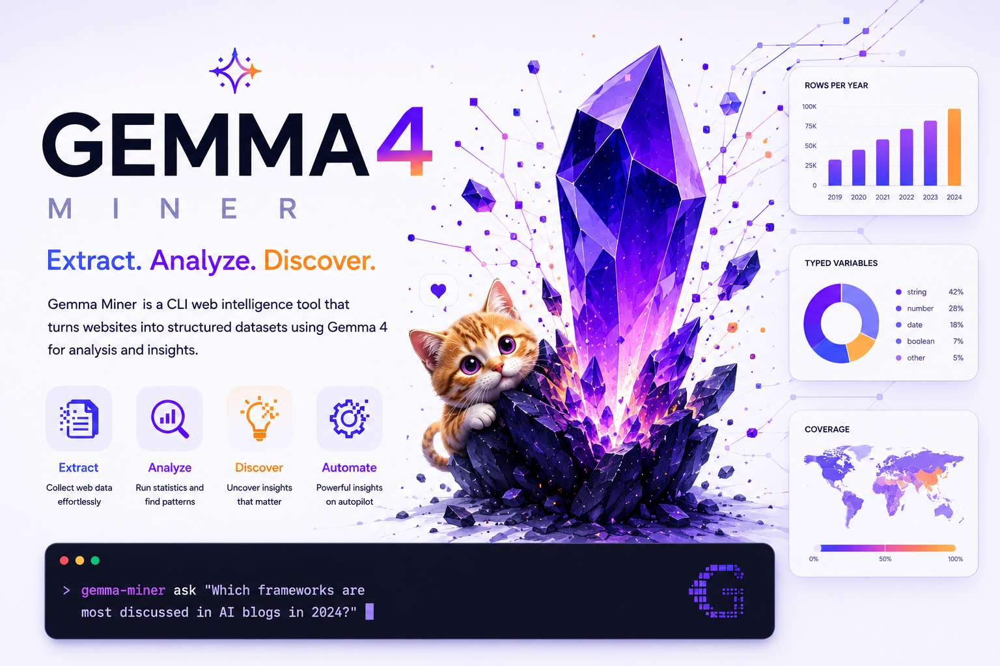

<div align="center">



# ⛏ Gemma Miner

**Turn any website or document corpus into a typed, research-grade dataset — in minutes, autonomously.**

[](https://pypi.org/project/gemma-miner/)
[](https://pypi.org/project/gemma-miner/)
[](https://pypi.org/project/gemma-miner/)
[](LICENSE)
[](https://huggingface.co/moncefem)

</div>

Gemma Miner is an autonomous agent that takes a one-sentence brief —
*"build me a stats-ready dataset of CNIL sanctions"*,
*"3 000 AI clinical trials"*,
*"every Hacker News 'Who is hiring' post mentioning RAG"* —
and produces a typed Parquet dataset with codebook, charts and HF-ready card.

It handles **harvest → typed schema design → per-row extraction →
self-verification → export to Parquet/CSV/HuggingFace** in a single run.
Works with **Ollama (local Gemma 4 31B)**, **OpenRouter**, **Together AI**,
**Featherless** — or any OpenAI-compatible endpoint.

---

## Why it exists

Most "scrape this site" tools give you a JSON dump of raw fields. That's not a
dataset — it's a starting point. Gemma Miner closes the loop:

1. **Read** the source (HTML, JSON API, PDF / DOCX / XLSX / archives).
2. **Design a codebook** of 20–60 typed analytical variables — booleans,
   enums, integers, dates — appropriate for the corpus.
3. **Extract every row** through the codebook with deterministic type
   coercion (dates → ISO, enums snapped to nearest valid value,
   booleans null-when-silent, no placeholder stuffing).
4. **Self-verify** before declaring done. If verification fails, retry
   with corrective feedback.
5. **Export** to Parquet + CSV + a Markdown codebook, and optionally push
   to the Hugging Face Hub with a one-line command.

The result is a dataset you can drop into pandas, DuckDB or scikit-learn
without a second cleaning pass.

## See it in action

Two real datasets built end-to-end by Gemma Miner — click through to read
their cards and load them:

| Dataset | Rows × Cols | Source | Try it |
|---|---|---|---|
| 🇫🇷 [**CNIL Sanctions 2011-2025**](https://huggingface.co/datasets/moncefem/cnil-sanctions-2011-2025) | 374 × 34 | [cnil.fr](https://www.cnil.fr/fr/les-sanctions-prononcees-par-la-cnil) | `load_dataset("moncefem/cnil-sanctions-2011-2025")` |
| 🧬 [**Clinical Trials of AI 2000-2025**](https://huggingface.co/datasets/moncefem/clinical-trials-ai-2000-2025) | 3 000 × 30 | [clinicaltrials.gov](https://clinicaltrials.gov) | `load_dataset("moncefem/clinical-trials-ai-2000-2025")` |

---

## Install

`gemma-miner` is a CLI tool, so the cleanest install is `uv tool install`
(or `pipx install`) — it puts a `gemma-miner` binary on your PATH inside an
isolated environment:

```bash
# recommended — installs as an isolated CLI tool
uv tool install gemma-miner

# with optional extras:
uv tool install "gemma-miner[parsers]"   # PDF / DOCX / XLSX / EPUB / archives
uv tool install "gemma-miner[hf]"        # huggingface_hub + datasets (for /push)
uv tool install "gemma-miner[analysis]"  # pandas + matplotlib + numpy
uv tool install "gemma-miner[all]"       # everything above
```

Then just run it from anywhere:

```bash
gemma-miner            # interactive REPL
gemma-miner configure  # re-run the setup wizard
gemma-miner --help     # full command list
```

Alternative installs:

| Use case | Command |
|---|---|
| Try it once without installing | `uv run --with gemma-miner gemma-miner` |
| Add it as a library to an existing project | `cd your-project && uv add gemma-miner` |
| Plain pip (no uv) | `pipx install gemma-miner` |

## First launch (Claude-Code style REPL)

```bash
gemma-miner
```

On first launch you get a setup wizard that walks you through:

1. Pick a provider (`ollama` / `openrouter` / `together` / `featherless`).
2. Paste an API key (or skip for Ollama — fully local).
3. Pick a default model. For Ollama, the wizard shows the live list of
   models you have installed (queried from `/api/tags`).

Your choice is saved to `~/.config/gemma-miner/config.toml` (chmod 600).
Switch any time with `/config` inside the REPL, or `gemma-miner configure`
from the shell.

Inside the REPL:

- Type **`/`** to see the live command palette (filters as you keep typing).
- Just type plain English to start a run: *"build me a dataset of the top
  100 Hacker News stories with id, title, points, comments."*
- Multi-line prompts: end the first line with `"""` to open a heredoc,
  close with `"""`.
- The agent runs with a live Rich activity feed showing every phase and
  per-row extraction progress.

## What the REPL knows how to do

| Slash command | What it does |
|---|---|
| `/help` | Full help panel |
| `/config` | Re-run the provider + API-key setup wizard |
| `/datasets` | List datasets produced under `./runs/` |
| `/workdir [<path>]` | Show or change the base workdir |
| `/provider [<name>]` | Show or switch LLM provider (persisted) |
| `/model [<id>]` | Show or switch model (persisted per provider) |
| `/gemma-full-local` | Switch every phase to Ollama Gemma (auto-picks the largest installed Gemma) |
| `/resume <path>` | Resume a previous run — load its dataset + codebook + memory |
| `/push <repo_id>` | Push the last dataset to Hugging Face Hub |
| `/history`, `/clear`, `/trace`, `/quit` | Standard shell controls |

After a run completes, the chat agent has the dataset in memory — ask
follow-up questions like *"which row had the most points?"* or
*"summarise the breakdown by sector"* and it answers from the data
without triggering another scrape.

## One-shot mode (no REPL)

```bash
# free-text prompt — Gemma Miner parses URL + count + fields automatically
gemma-miner "Build a dataset of every CNIL sanction from \
https://www.cnil.fr/fr/les-sanctions-prononcees-par-la-cnil with date, \
organisation type, breaches, decision text and 25 analytical variables."

# explicit flags for power users
gemma-miner run \
  --goal "Top 100 Hacker News stories" \
  --min-rows 100 \
  --required-fields rank,id,title,points \
  --unique-field id \
  --workdir ./runs/hn \
  --provider ollama \
  --model gemma4:31b
```

## Python API

```python
from gemma42 import (
    FieldsContract, MinRowsContract, UniqueFieldContract,
    make_llm, run_agent,
)

result = run_agent(
    goal=(
        "Build a dataset of the top 100 Hacker News stories using the public "
        "JSON API. Each row needs rank, id, title, domain, points."
    ),
    contracts=[
        MinRowsContract(min_rows=100),
        FieldsContract(required_fields=["rank", "id", "title", "points"]),
        UniqueFieldContract(field="id"),
    ],
    unique_key="id",
    workdir="./runs/hn",
    llm=make_llm("openrouter", model="google/gemini-3.1-flash-lite"),
)
print(result.dataset_path)
```

> The Python module is still named **`gemma42`** internally (the brand
> was previously `gemma42`); the PyPI package is `gemma-miner`. Both
> CLI commands (`gemma-miner` and `gemma42`) are equivalent.

## Architecture

```
goal (one sentence)
    │
    ▼
┌─────────────────────────────────────────┐
│   AgentState (dataset + contracts +     │
│   memory + plan + workdir)              │
└─────────────────────────────────────────┘
    │
    ▼
┌─────────────────────────────────────────┐
│   Phase machine (recomputed every turn  │
│   from observable state):               │
│                                         │
│   DISCOVER_LISTING → ENUMERATE →        │
│   DISCOVER_DETAIL → PROCESS →           │
│   CODEBOOK → EXTRACT → EXPORT → FINISH  │
└─────────────────────────────────────────┘
    │
    ▼
┌─────────────────────────────────────────┐
│   One LLM call per turn → one tool      │
│   call (HTTP / HTML / Python / extract /│
│   codebook ops / dataset / queue / …)   │
└─────────────────────────────────────────┘
    │
    ▼
┌─────────────────────────────────────────┐
│   Self-verification before finish.      │
│   On fail, re-enter the loop with the   │
│   verifier's feedback in the prompt.    │
└─────────────────────────────────────────┘
```

Key design choices:

- **One tool call per turn.** Each step is auditable; the trace is a
  flat JSONL of decisions.
- **Re-rendered state brief** every turn instead of chat history. No
  context drift, no stale observations.
- **Phase-narrowed tool list.** The model sees 5–8 relevant tools per
  turn, not 30 — small models behave dramatically better this way.
- **Null-not-false discipline.** Booleans are `null` when the source is
  silent. The system prompt forbids placeholder stuffing and the
  contract checks surface low-cardinality "constants" as evidence.
- **Deterministic IDs.** Bronze (raw harvest) and silver (typed
  extraction) join by stable content-hash id — re-runs converge.
- **Hysteresis.** Once the silver dataset is populated, the phase
  machine refuses to fall back into harvest for marginal gains.

## Providers

| Provider | What it gives you | Default model |
|---|---|---|
| **Ollama** | 100 % local, no API key | `gemma4:31b` (wizard shows your installed models) |
| **OpenRouter** | Cheapest router for cloud models | `google/gemini-3.1-flash-lite` |
| **Together AI** | Fast OSS models | `google/gemma-4-31b-it` |
| **Featherless** | Serverless GPU for OSS models | `google/gemma-4-31b-it` |
| Anything else | Any OpenAI-compatible endpoint via `--base-url` | — |

Run `gemma-miner providers` to print the full list.

## Push to Hugging Face

After a run, push to a public dataset repo from inside the REPL:

```text
› /push moncefem/my-cool-dataset
✓ uploaded → https://huggingface.co/datasets/moncefem/my-cool-dataset
```

Or from the shell:

```bash
gemma-miner export-hf ./runs/hn/dataset.jsonl --repo-id you/hn-top100
```

Needs `HF_TOKEN` (or `HUGGINGFACE_HUB_TOKEN`) in the environment and the
`hf` extra installed.

## Safety

- The `bash` and `python` tools refuse destructive operations (`rm`, `dd`,
  `mkfs`, `sudo`, fork bombs, …) at the tool layer.
- File operations are confined to the run's workdir.
- The config file is `chmod 600` so API keys aren't readable by other
  users on a shared machine.

Don't run agent code on production boxes — use a container or VM.

## Contributing

Bugs, ideas, and pull requests welcome at
<https://github.com/moncifem/gemma-miner>.

The test suite runs offline:

```bash
uv pip install -e ".[dev]"
pytest -q
```

## License

[Apache License 2.0](LICENSE).

If you use Gemma Miner in a paper, project, or product, attribution to
the upstream source and to Gemma Miner is appreciated:

```bibtex
@software{elmouden_gemma_miner_2025,
  title  = {Gemma Miner: an autonomous text-to-dataset agent},
  author = {EL-Mouden, Moncif and contributors},
  year   = {2025},
  url    = {https://github.com/moncifem/gemma-miner},
}
```

---

<div align="center">

⛏ Made with care by <a href="https://huggingface.co/moncefem">Moncif EL-Mouden</a>.
Powered by your favourite small open model.

</div>
